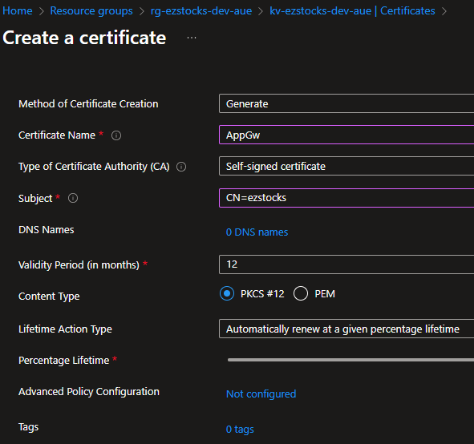

# EzStocks

## AppGateway certificate

- Create a self-signed certificate in KeyVault using a host/domain name (don't use an IP as that results in an ERR_SSL_UNRECOGNIZED_NAME_ALERT brower error).
  
- Reference the certificate created in the `Listeners` created.
- To run locally, I added the dummy hostname to my local `C:\Windows\System32\drivers\etc\hosts` file.
- Ensure to update the redirect URIs for the UI's AppRegistration.
